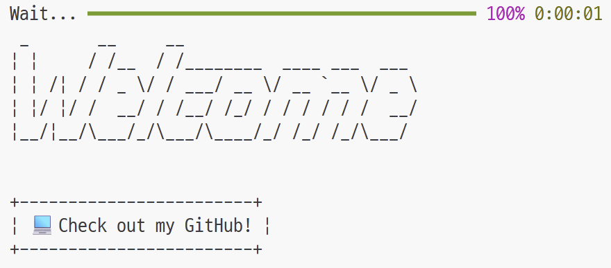

<!--
**slwnt31/slwnt31** is a ✨ _special_ ✨ repository because its `README.md` (this file) appears on your GitHub profile.

Here are some ideas to get you started:

- 🔭 I’m currently working on ...
- 🌱 I’m currently learning ...
- 👯 I’m looking to collaborate on ...
- 🤔 I’m looking for help with ...
- 💬 Ask me about ...
- 📫 How to reach me: ...
- 😄 Pronouns: ...
- ⚡ Fun fact: ...
-->


<p align="center">
  
</p>

---

# 👋 Hi, I'm Sujin.

🎓 **Major in Computer Engineering**  
💻 **Interested in Backend Development**  
🚀 Passionate about building efficient and reliable systems  
📚 Always learning new technologies to improve my skills  

---

### 💡 Tech Interests
- Backend Architecture  
- RESTful APIs & Microservices  
- Database Design & Optimization  

---

### 💡 Tech Stack
<p>
  
  
  
</p>


### 📫 Let's Connect!
[](https://github.com/slwnt31)
[](https://instagram.com/zerthoe)


## About My CLIck-Me RePository..
- Clone this repository:
```sh
git clone https://github.com/slwnt31/CLIck-Me.git
```
- Install the dependencies:
```sh
python -m venv hellopy-cli

hellopy-cli\Scripts\activate.bat

pip install click colorama pyfiglet rich
```
- Usage:
```
python BaekSujin/cli-proflie.py
```

